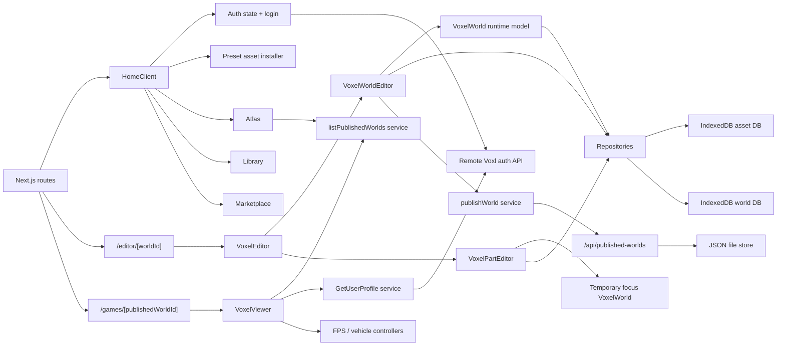

# Microcosm Architecture Map

This document maps the current architecture of the project as it exists today.
It is intentionally descriptive first, then opinionated about the main seams
that would let the codebase become more principled over time.

## 1. Project Shape

The repository is a single Next.js application with a very thin server layer and
a very large client-side runtime.

Primary top-level areas:

- `src/app`
  - Next.js entrypoints and route pages.
- `src/components/Auth`
  - Authentication context and login UI.
- `src/components/Home`
  - Home shell for atlas, library, and marketplace.
- `src/components/VoxelEditor`
  - The dominant subsystem. Owns runtime world editing, focus editing, local
    persistence, asset lifecycle, import, autosave, and world publishing.
- `src/components/VoxelViewer`
  - Published-world playback and play-mode runtime.
- `src/services`
  - HTTP clients for auth/user data and published-world API calls.
- `src/materials`
  - Shared Three.js material patch helpers.
- `data`
  - Local JSON storage for published worlds in development.
- `public`
  - Static media, presets, baked meshes, voxel asset JSON, and runtime textures.

## 2. System Topology

## 3. Runtime Slices

### 3.1 App shell and route composition

The route layer is intentionally small:

- `src/app/page.tsx`
  - Renders `HomeClient`.
- `src/app/editor/[worldId]/page.tsx`
  - Renders `VoxelEditor` with a route-selected world id.
- `src/app/games/[publishedWorldId]/page.tsx`
  - Renders `VoxelViewer` with a route-selected published-world id.
- `src/app/layout.tsx`
  - Installs two global providers:
    - `AuthProvider`
    - `SoundProvider`

Architecturally, this means almost all meaningful state and orchestration lives
below the route layer in large client components.

### 3.2 Boot and authentication

Main files:

- `src/app/HomeClient.tsx`
- `src/components/Auth/state.tsx`
- `src/components/Auth/LoginScreen.tsx`
- `src/services/auth.ts`
- `src/services/authClient.ts`
- `src/services/user.ts`

Current flow:

1. `AuthProvider` stores auth state in localStorage.
2. `HomeClient` boots the app.
3. If a token exists, `HomeClient` calls `Me()` to validate it.
4. On successful auth, `HomeClient` installs preset assets into IndexedDB and
   preloads some static home media.
5. Unauthenticated users see `LoginScreen`.
6. Authenticated users see the tabbed home shell.

Important observation:

- `HomeClient` currently mixes auth gating, app bootstrap, preset installation,
  static media preloading, tab state, and some debug globals.

### 3.3 Home shell

Main files:

- `src/components/Home/Atlas/Atlas.tsx`
- `src/components/Home/Library/Library.tsx`
- `src/components/Home/Marketplace/Marketplace.tsx`
- `src/components/Home/PackedGrid/PackedGrid.tsx`

Each tab mostly acts as a query-and-render shell:

- `Library`
  - Talks to `worldRepository`.
  - Creates, renames, deletes, and opens local worlds.
- `Marketplace`
  - Talks to `assetRepository`.
  - Lists marketplace assets from local IndexedDB and lets users "buy" them
    into their private library.
- `Atlas`
  - Calls the published-world API.
  - Resolves publisher usernames from the remote auth API.
  - Resolves asset names locally from IndexedDB.
  - Navigates into the viewer route.

Important observation:

- The product language suggests remote marketplace behavior, but much of the
  actual marketplace inventory is local-first and IndexedDB-backed.

### 3.4 World editor shell

Main files:

- `src/components/VoxelEditor/VoxelEditor.tsx`
- `src/components/VoxelEditor/VoxelWorldEditor.tsx`
- `src/components/VoxelEditor/VoxelPartEditor.tsx`

`VoxelEditor` is a coordinator around two editor modes:

- `VoxelWorldEditor`
  - World-level editing.
  - Asset placement.
  - Glyph tagging.
  - Group movement and rotation.
  - Autosave.
  - Publish world.
- `VoxelPartEditor`
  - Focus mode.
  - Isolated editing of a single asset/group instance.
  - Decides whether edits become:
    - non-structural source updates
    - structural instance overrides
    - full source overwrites
    - remixed assets

The shell also owns:

- editor loading state
- audio readiness
- focus open/close transitions
- world-to-focus handoff

### 3.5 World runtime model

Main file:

- `src/components/VoxelEditor/VoxelWorld.ts`

This is the core runtime object model of the editor. It is not just a visual
scene helper; it is the real in-memory representation of a world.

It currently owns all of these responsibilities:

- Group identity and grouping semantics.
- Group position and quarter-turn rotation.
- Group source metadata:
  - `assetId`
  - `assetKind`
  - `overrideAssetId`
  - `logicTag`
  - `instanceId`
- World-space voxel indexing.
- Local-space voxel storage per group.
- Three.js mesh creation and disposal.
- Material selection for normal and blueprint voxels.
- Bounds calculations.
- Import/export of persisted world data.
- Refreshing all instances when a source asset changes.
- Baking the published-world payload used by the viewer.

Key domain concepts inside `VoxelWorld`:

- `GroupState`
  - Logical local voxels plus group identity/position.
- `WorldData`
  - Persisted list of placed instances.
- `PublishedWorldBakedSnapshot`
  - Runtime world baked into grouped render surfaces for publishing.

Important observation:

- `VoxelWorld` is the heart of the app, but it is not yet a pure domain model.
  It directly imports `assetRepository`, builds meshes, and knows about
  publishing payload structure.

### 3.6 Focus-mode editor

Main file:

- `src/components/VoxelEditor/VoxelPartEditor.tsx`

Focus mode uses a second temporary `VoxelWorld` instance as an isolated editing
workspace for a single selected group.

Current flow:

1. Copy selected group voxels into a temporary focus world.
2. Let the user edit voxels with tools like pencil, eyedropper, and marquee.
3. Compare edited voxel coordinates to the initial shape to detect structural
   changes.
4. On exit, choose one of several persistence strategies:
   - overwrite mutable private source asset
   - save non-structural progress back to source
   - create/update instance override asset
   - remix into a new private asset
5. Commit the resulting shape back into the live world instance.

Architecturally, this is a strong domain idea:

- "Instance edits are not always source edits."

But the decision policy currently lives inside the UI component rather than a
formal application service.

### 3.7 Persistence layer

Main files:

- `src/components/VoxelEditor/repositories/AssetRepository.ts`
- `src/components/VoxelEditor/repositories/WorldRepository.ts`
- `src/components/VoxelEditor/repositories/indexedDbAssetRepository.ts`
- `src/components/VoxelEditor/repositories/indexedDbWorldRepository.ts`
- `src/components/VoxelEditor/database/AssetDb.ts`
- `src/components/VoxelEditor/database/LibraryDb.ts`

There is a good architectural shape here already:

- Repository interfaces exist.
- IndexedDB implementations sit behind them.
- Domain mappers exist for cloud-style documents.

Asset persistence currently supports:

- private assets
- marketplace assets
- library membership
- lineage tracking
- preset installation
- private draft forking
- instance overrides
- thumbnail persistence
- light key-value storage

World persistence currently supports:

- save/load/delete/rename local worlds
- storing world metadata and world instance data separately

Important observation:

- The repository boundary is present, but the infrastructure layer still
  contains a lot of workflow policy, naming conventions, and cross-cutting
  behaviors that feel closer to application logic.

### 3.8 Publishing pipeline

Main files:

- `src/services/publishedWorlds.ts`
- `src/app/api/published-worlds/route.ts`
- `src/components/VoxelEditor/domain/publishedWorldTypes.ts`

Current flow:

1. `VoxelWorldEditor` asks `VoxelWorld` for a baked published snapshot.
2. The baked snapshot includes render-ready grouped face buckets.
3. `publishWorld()` POSTs that payload to `/api/published-worlds`.
4. The API route validates the payload and writes it to a JSON file.
5. `Atlas` and `VoxelViewer` read from the same endpoint.

Properties of the current published format:

- It is viewer-oriented, not editor-oriented.
- It stores baked triangle surfaces, not raw logical voxel groups.
- It also stores source lineage hints like `latestMarketplaceAssetId`.

Important observation:

- The published-world route is effectively the only internal server domain in
  the project today.

### 3.9 Viewer and play runtime

Main files:

- `src/components/VoxelViewer/VoxelViewer.tsx`
- `src/components/VoxelViewer/controllers/fpsController.ts`
- `src/components/VoxelViewer/controllers/vehicleController.ts`
- `src/components/VoxelViewer/controllers/vehicleEffectsController.ts`
- `src/materials/animatedHeightMist.ts`

Current flow:

1. `VoxelViewer` loads a published world document by id.
2. It resolves author profile data through the auth API.
3. It reconstructs Three.js geometry from the stored face buckets.
4. It loads baked island scenery, sky layers, HDRI, and the `Jeff` avatar GLB.
5. It offers two interaction modes:
   - orbit/view mode
   - play mode
6. In play mode it supports:
   - FPS movement
   - pointer lock
   - enterable drivable vehicles for some marketplace asset ids

Architectural note:

- Viewer controller modules are cleaner than the editor files.
- The viewer still remains a large orchestration component that owns scene boot,
  asset loading, play-state switching, published-world loading, and UI overlays.

## 4. Data Model Map

### 4.1 Asset model

Current persistent asset layers:

- `AssetMetaRecord`
  - Name, timestamps, visibility, thumbnail, lineage, library state.
- `AssetRecord`
  - Metadata plus `GroupState`.
- Cloud-flavored shapes:
  - `DraftAssetDocument`
  - `MarketplaceAssetDocument`

Semantically, the app distinguishes:

- source assets
- published marketplace assets
- mutable private drafts
- preset assets
- instance override assets
- remixed assets

### 4.2 World model

Persistent world layers:

- `WorldRecord`
  - Metadata plus `WorldData`
- `WorldData`
  - Array of placed asset instances
- `WorldInstanceRecord`
  - Asset reference, optional override, position, rotation, logic tag

Semantically, the world is an assembly of asset instances, not a freeform raw
voxel canvas.

### 4.3 Published world model

Published world layers:

- `PublishedWorldDocument`
  - Public record for a playable/browseable world
- `PublishedWorldGroupPayload`
  - Per-group baked geometry and metadata
- `PublishedWorldSurfacePayload`
  - Face-bucket arrays for rendering

This model is already separated from local editor persistence, which is good.

## 5. Current Layering, As-Is

If we describe the project in layers, the current shape looks like this:

### Presentation layer

- Next.js pages
- Home components
- Auth login UI
- Editor UI panels
- Viewer overlays

### Application/orchestration layer

- `HomeClient`
- `VoxelEditor`
- large parts of `VoxelWorldEditor`
- large parts of `VoxelPartEditor`
- large parts of `VoxelViewer`

### Domain/runtime layer

- `VoxelWorld`
- asset/world/published-world types
- viewer controllers
- voxel import parser

### Infrastructure layer

- Axios service clients
- repository implementations
- IndexedDB DB files
- file-backed published-world API route
- public presets and static media

Important reality:

- These layers exist conceptually, but many files currently cross layers
  directly.

## 6. Main Coupling Points

These are the places where shortcuts appear most likely to have accumulated.

### 6.1 `VoxelWorld` is both domain model and infrastructure adapter

Symptoms:

- imports `assetRepository`
- knows how to publish baked surfaces
- owns Three.js mesh lifecycle
- owns persistence export/import shape

Risk:

- any attempt to improve persistence, runtime rules, or rendering will keep
  touching the same class

### 6.2 `VoxelWorldEditor` is a mega-orchestrator

It currently combines:

- scene boot
- input system
- selection and hover state
- group drag behavior
- glyph tagging
- asset placement
- file import
- autosave policy
- world loading/creation
- publish flow
- panel UI state

Risk:

- changes in one workflow can easily destabilize unrelated workflows

### 6.3 `VoxelPartEditor` contains valuable policy but hides it inside UI code

It currently decides:

- what counts as a structural change
- when to overwrite source
- when to preserve source and create override
- when to remix
- when a non-structural edit should fan out to other instances

Risk:

- this policy is central to product semantics, but it is difficult to test or
  reuse because it is embedded inside a React + Three.js component

### 6.4 Repository layer is present, but application services are mostly absent

The code has repositories, but fewer explicit use-case services like:

- `LoadEditorWorld`
- `CommitFocusedAssetEdits`
- `PublishCurrentWorld`
- `PlaceAssetInstance`
- `ApplyGlyphTag`

Risk:

- components talk directly to repositories and runtime objects, so workflow
  rules are spread across UI files

### 6.5 Bootstrapping is overloaded into `HomeClient`

It owns:

- auth gate
- preset DB installation
- preload behavior
- debug globals
- tab shell

Risk:

- app startup rules are hard to evolve cleanly

### 6.6 Viewer loading is tightly coupled to rendering reconstruction

`VoxelViewer` handles:

- fetching published world data
- fetching author profile
- reconstructing geometry
- mode switching
- interaction runtime

Risk:

- hard to reuse the published-world format elsewhere
- hard to test world loading independent of renderer boot

## 7. Architectural Strengths Already Present

There is already enough structure here to evolve into something elegant.

- The app has distinct product slices: auth, library, marketplace, editor,
  published viewer.
- Repository interfaces already exist.
- Domain types are reasonably explicit.
- The concept of "world as placed asset instances" is principled.
- The distinction between source asset, remix, and instance override is strong.
- Published-world format is separate from local editor save format.
- Viewer movement logic is already partially decomposed into controller modules.

## 8. Recommended Target Shape

If we wanted a more principled architecture without changing the product model,
the most natural target would be:

### Domain layer

Pure rules and models:

- voxel/group/world model
- asset lineage and override semantics
- structural-vs-non-structural edit rules
- publishing bake rules

### Application layer

Explicit use cases:

- load world session
- autosave world session
- place asset instance
- apply glyph to instance
- commit focus edit
- publish world
- load published world for viewer

### Infrastructure layer

- IndexedDB implementations
- HTTP clients
- file-backed published-world storage
- asset preset installer

### Presentation layer

- React components
- Three.js scene adapters
- input bindings
- overlays and panels

The key architectural move would be:

- keep React and Three.js as adapters around workflows, not as the home for the
  workflows themselves

## 9. Suggested Refactor Order

This is the order that looks safest and highest leverage.

### 9.1 Extract editor application services first

Best candidates:

- `commitFocusedAssetEdit(...)`
- `publishWorldFromSession(...)`
- `loadWorldIntoSession(...)`
- `autosaveWorldSession(...)`

Why first:

- highest logic density
- biggest reduction in component size
- minimal product rewrite

### 9.2 Separate `VoxelWorld` into runtime core vs adapters

Possible split:

- `VoxelWorldModel`
  - logical groups, instances, overrides, bounds, bake rules
- `VoxelWorldSceneAdapter`
  - mesh creation, scene sync, materials

Why second:

- this becomes the foundation for all later cleanup

### 9.3 Normalize persistence policy out of `AssetDb`

Possible split:

- raw IndexedDB gateway
- repository mapping
- asset lifecycle service

Why:

- today storage and workflow policy are interleaved

### 9.4 Slim boot and viewer orchestration

Candidates:

- `HomeClient` boot service
- `VoxelViewer` world-loading service

Why later:

- these are important, but the editor subsystem is where most architectural
  leverage sits

## 10. First Areas That Look "Obviously Shortcut-Heavy"

These are the most obvious places to solidify with you next.

- `src/components/VoxelEditor/VoxelWorldEditor.tsx`
  - too many responsibilities in one file
- `src/components/VoxelEditor/VoxelPartEditor.tsx`
  - important persistence semantics trapped in UI code
- `src/components/VoxelEditor/VoxelWorld.ts`
  - domain, rendering, persistence, and publishing mixed together
- `src/components/VoxelViewer/VoxelViewer.tsx`
  - loading, rendering, and interaction runtime tightly fused
- `src/app/HomeClient.tsx`
  - bootstrapping and app shell combined
- `src/components/VoxelEditor/database/AssetDb.ts`
  - storage operations and asset policy mixed together

## 11. Practical Summary

The project is not architecture-less. It already has a strong product model:

- worlds are assemblies of asset instances
- assets can be remixed or overridden
- published worlds are baked view artifacts
- the editor and viewer are different runtimes

The main issue is that too much of the important policy currently lives inside a
few giant React/Three files instead of explicit application and domain modules.
That is good news, because it means the cleanup path is mostly about extracting
and clarifying boundaries rather than inventing the product model from scratch.
